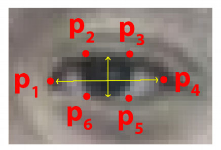
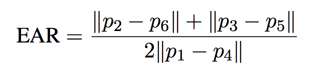
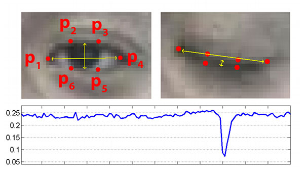

# Mining Worker & Explorer Safety Helmet

A sophisticated safety system for mining helmets, integrating multiple sensors and real-time monitoring capabilities using Raspberry Pi 4.

## Table of Contents
- [Overview](#overview)
- [Features](#features)
- [Hardware Requirements](#hardware-requirements)
- [Software Dependencies](#software-dependencies)
- [System Components](#system-components)
- [Pin Configuration](#pin-configuration)
- [Setup and Installation](#setup-and-installation)
- [Testing Tools](#testing-tools)
- [System Architecture](#system-architecture)

## Overview

This project implements an advanced safety monitoring system for mining helmets. It combines computer vision for drowsiness detection, environmental sensing, motion tracking, and wireless communication to create a comprehensive safety solution for mining workers and explorers.

## Features

- **Gyro Calibration Button (GPIO 17):** Allows the helmet to set its current orientation as zero. Essential for adapting to different head positions and environments.
- **Helmet Tilt Detection:** If the helmet is tilted more than 90° for over 5 seconds (using MPU6050), the system activates the camera and sets GPIO 27 high to turn on an LED. This indicates a possible fall or collapse.
- **Conditional Camera Activation:** OpenCV drowsiness/face detection only runs when the helmet is tilted. This saves power and processing, and only monitors when needed.
- **Collapse Detection & Emergency Alert:** If no face is detected when the helmet is tilted, the system sends a "COLLAPSED" alert and GPS coordinates via HC-12, spamming until a face is detected again. This helps rescuers locate and respond quickly.
- **MQ Gas Sensor Integration (e.g., MQ-2, MQ-7, MQ-135):** If any harmful gas is detected above a threshold, the system sets GPIO 22 high to alert the miner (buzzer/LED) and sends the gas type, percentage, and GPS coordinates via HC-12. This provides real-time hazardous gas monitoring and alerting. The code supports analog MQ sensors via MCP3008 (SPI), and can be extended for digital sensors.
- **Robust Sensor Handling:** The code runs even if some sensors or UART are missing. All sensor values default to -1 if unavailable, ensuring the helmet remains operational in degraded mode.
- **Automatic Camera Selection:** The system auto-selects between USB webcam and PiCamera2 for maximum compatibility.
- **Optimized Performance:** Frame resizing, reduced blocking, and face detection interval logic allow higher FPS and lower CPU usage on Raspberry Pi 4.
- **Debug Output:** The code prints diagnostic information for face/eye detection, EAR values, and FPS for easy troubleshooting.
- **Normal Operation:** When the helmet is upright, only environmental and motion data (temperature, humidity, acceleration, gyro, GPS) are sent via HC-12. The camera remains off, saving battery and reducing distraction.

---

## Quick Start


### Core Safety Features
1. **Drowsiness Detection System**
   - Real-time eye monitoring using facial landmarks
   - Eye Aspect Ratio (EAR) calculation for drowsiness detection
   - Configurable threshold (default: 0.25) and frame check count (default: 6)
   - Visual alerts on detected drowsiness
   - Automatic face detection optimization with caching

2. **Motion and Orientation Monitoring**
   - Head tilt detection via MPU6050
   - Wiggle detection system
   - Configurable parameters:
     - Wiggle threshold: 20
     - Wiggle window: 2.0 seconds
     - Required wiggle count: 3
   - Gyroscope calibration via button (GPIO 17)

3. **Environmental Monitoring**
   - Temperature and humidity sensing (DHT22/DHT11)
   - Gas detection (MQ series sensors)
   - Configurable update intervals:
     - Sensors: 0.05s
     - DHT: 3.0s
     - GPS: 1.0s

4. **GPS Location Tracking**
   - Real-time position monitoring
   - GPS fix status indication via LED (GPIO 25)
   - LED patterns:
     - Solid: GPS fix acquired
     - Blinking (1 Hz): Searching for fix
     - Off: GPS disabled/error

### System Features
1. **Camera Management**
   - Automatic camera selection (USB webcam/PiCamera2)
   - Configurable parameters:
     - Resolution: 320x240
     - FPS: 20
     - Orientation options: normal/flip/rotate_90/180/270
   - Power-efficient activation based on events

2. **Alert System**
   - Multi-channel alerting:
     - Visual (LED indicators)
     - Audible (Buzzer on GPIO 23)
     - Wireless (HC-12 transmission)
   - Alert types:
     - Drowsiness detection
     - Gas presence
     - GPS status
     - System status

3. **Performance Optimization**
   - Frame resizing for efficient processing
   - Face detection caching
   - Configurable FPS targeting (default: 15)
   - Memory usage monitoring and cleanup
   - Non-blocking I/O operations

4. **Data Logging**
   - CSV-based event logging
   - Timestamp recording
   - Sensor data capture
   - Alert history
   - GPS coordinates tracking

## Hardware Requirements

### Core Components
- Raspberry Pi 4 (4GB RAM recommended)
- Camera options:
  - USB webcam
  - Raspberry Pi Camera (PiCamera2 compatible)

### Sensors
1. **Environmental Sensors**
   - DHT22/DHT11 temperature and humidity sensor
     - Data pin: GPIO 4
   - MQ series gas sensor
     - Alert pin: GPIO 22
     - ADC integration (ADS1115 or MCP3008)

2. **Motion Sensors**
   - MPU6050 accelerometer/gyroscope
     - I2C interface
     - 3-axis acceleration and rotation sensing

3. **GPS Module**
   - NEO-6M or compatible
   - UART interface
   - 9600 baud rate

### Communication
- HC-12 wireless module
  - UART interface
  - 9600 baud rate
  - Configurable channels and power levels

### Input/Output
1. **Buttons and Controls**
   - Calibration button (GPIO 17)
   
2. **Indicators**
   - Main LED (GPIO 27)
   - GPS status LED (GPIO 25)
   - Buzzer (GPIO 23)

## Pin Configuration

| Component | Pin | Description |
|-----------|-----|-------------|
| Buzzer | GPIO 23 | Alert sound output |
| Button | GPIO 17 | Gyro calibration |
| Main LED | GPIO 27 | Visual indicator |
| MQ Alert | GPIO 22 | Gas detection alert |
| GPS LED | GPIO 25 | GPS fix status |
| DHT Sensor | GPIO 4 | Temperature/Humidity data |
| MPU6050 | I2C | SDA/SCL pins |
| HC-12 | UART | TX/RX pins |
| GPS Module | UART | TX/RX pins |

## Software Dependencies

### Python Packages
- OpenCV (cv2)
- dlib
- imutils
- numpy
- scipy
- RPi.GPIO
- smbus2
- serial
- adafruit_dht
- psutil

### System Requirements
- Python 3.x
- Face landmarks model file
- I2C, SPI, and UART enabled on Raspberry Pi

## Testing Tools

The system includes multiple testing utilities:

1. **Serial Communication**
   - `serial_test.py`: Tests serial ports and baud rates
   - `hc12_test_transmit.py`: HC-12 transmission testing
   - `hc12_receiver.py`: HC-12 reception testing

2. **Sensor Testing**
   - `ads1115_check.py`: ADC functionality
   - `dht11_check.py`/`dht22_check.py`: Temperature/humidity
   - `gps_check.py`: GPS functionality
   - `mpu6050_check.py`: Motion sensor
   - `mq_check.py`: Gas sensor

## System Architecture

### Core Classes
1. `HelmetSafetySystem`: Main system coordinator
2. `CameraManager`: Camera handling and processing
3. `DrowsinessDetector`: Eye monitoring and alerting
4. `SensorData`: Thread-safe data management
5. `PerformanceMonitor`: System metrics tracking

### Sensor Classes
1. `MPU6050Sensor`: Motion tracking
2. `DHTSensor`: Environmental monitoring
3. `GPSSensor`: Location tracking
4. `HC12Communication`: Wireless communication

### Configuration
All system parameters are centralized in the `Config` class for easy customization.
- Physical button (for gyro calibration)
- Buzzer (for drowsiness alert)

## Wiring and GPIO Pinout

### Detailed Pin Connections

#### Power Pins
```
3.3V (Pin 1):
  - DHT22/DHT11 VCC
  - MPU6050 VCC

5V (Pin 2 or 4):
  - HC-12 VCC

Ground Pins (Pin 6, 9, 14, 20, 25, 30, 34, or 39):
  - All components' GND pins must be connected to a ground pin
```

#### GPIO Connections
```
GPIO 4 (Pin 7):     DHT22/DHT11 DATA pin
GPIO 14 (Pin 8):    HC-12 RX pin (connects to HC-12 TX)
GPIO 15 (Pin 10):   HC-12 TX pin (connects to HC-12 RX)
GPIO 17 (Pin 11):   Button (other terminal to Ground)
GPIO 23 (Pin 16):   Buzzer positive (negative to Ground)
GPIO 27 (Pin 13):   LED anode via 220Ω resistor (cathode to Ground)
GPIO 22 (Pin 15):   MQ Gas Alert pin

I2C Connections (MPU6050):
GPIO 2/SDA1 (Pin 3): MPU6050 SDA
GPIO 3/SCL1 (Pin 5): MPU6050 SCL
```

#### Component-specific Notes
1. **HC-12 Wireless Module**
   - VCC → 5V
   - GND → Ground
   - TX → GPIO15 (RXD)
   - RX → GPIO14 (TXD)

2. **DHT22/DHT11 Temperature Sensor**
   - VCC → 3.3V
   - DATA → GPIO4
   - GND → Ground

3. **MPU6050 Accelerometer/Gyroscope**
   - VCC → 3.3V
   - GND → Ground
   - SDA → GPIO2 (SDA1)
   - SCL → GPIO3 (SCL1)

4. **LED Indicator**
   - Anode → GPIO27 through 220Ω resistor
   - Cathode → Ground

5. **Buzzer**
   - Positive → GPIO23
   - Negative → Ground

6. **Button**
   - One terminal → GPIO17
   - Other terminal → Ground

## Software Architecture

- **Language & Libraries:** Python 3, OpenCV, dlib, imutils, RPi.GPIO, smbus2, serial, psutil, gc, Adafruit_DHT, spidev
- **Modular Classes:** Each sensor and subsystem is encapsulated in a dedicated class for maintainability and extensibility.
- **Multi-threaded Sensor Polling:** Ensures real-time responsiveness and non-blocking operation.
- **Main Loop:** Coordinates sensor fusion, camera activation, drowsiness detection, and alerting.
- **Performance Monitoring:** Tracks FPS, processing time, and memory usage for long-term stability.
- **Error Handling:** All hardware and threads are protected against runtime errors, with safe resource cleanup.

## System Operation

1. **Startup:** Initializes all sensors, camera, and communication modules. Gyroscope is automatically calibrated.
2. **Wiggling Detection:** Rapid head movements detected by MPU6050 activate the camera and LED.
3. **Drowsiness Detection:** Camera processes frames for facial landmarks. If eyes are closed (EAR below threshold for several frames), drowsiness is detected and buzzer is activated.
4. **Alerting:**
    - **Drowsiness Detected:** Buzzer activates, GPS coordinates and sensor data are sent via HC-12.
    - **No Face Detected:** Buzzer deactivates, alert sent via HC-12.
    - **Eyes Detected & Not Drowsy:** Camera and buzzer deactivate until next wiggle.
5. **Environmental Sensing:** MQ gas sensor triggers alert and sends data if harmful gas detected.
6. **User Interaction:** Physical button or terminal command recalibrates gyro. 'q' or 'quit' exits system.
7. **Cleanup:** All hardware and resources are safely released on exit or error.

## Example Usage

```bash
python3 Drowsiness_Detection.py
```

## Code Structure

- `Drowsiness_Detection.py`: Main system logic and modular classes for sensors, camera, drowsiness detection, and communication.
- `gps_check.py`, `dht11_check.py`, `mpu6050_check.py`, `mq_check.py`: Individual sensor test scripts for hardware validation.
- `models/shape_predictor_68_face_landmarks.dat`: Required for facial landmark detection (download from dlib.net).
- `assets/`: Example images and resources.

## Professional Implementation Notes

- All hardware interfaces are robustly error-handled for field reliability and safety.
- GPIO pins are initialized and cleaned up to prevent hardware lockups and ensure safe operation.
- Modular class design enables easy extension, maintenance, and future upgrades.
- Performance monitoring and memory management are included for long-term stability in harsh environments.
- Buzzer integration provides immediate physical feedback for drowsiness, enhancing safety.
- System is suitable for real-world mining helmet deployment and can be adapted for other safety-critical applications.

## Extending the System

- Add support for additional sensors (e.g., air quality, vibration, light).
- Integrate cloud-based alerting, remote monitoring, and data logging.
- Expand user interface for configuration, diagnostics, and reporting.
- Add wiring diagrams, PCB layouts, and enclosure designs for manufacturing.

## License

See LICENSE.txt for details.
Where p1–p6 are the eye landmark points (see image below). The numerator sums the distances between the vertical eye landmarks, and the denominator is the distance between the horizontal eye landmarks.



#### 3. Drowsiness Logic

- For each frame, the EAR is computed for both eyes and averaged.
- If the average EAR drops below 0.25 for 20 consecutive frames, the system triggers a drowsiness alert (visual warning on the video frame).
- The threshold and frame count are tunable for different users and environments.



#### 4. Robustness

- The EAR method is robust to normal blinking, as blinks are brief and do not persist for 20 frames.
- The system works in real time on Raspberry Pi 4, processing frames at ~10–15 FPS depending on lighting and camera quality.



#### 5. Limitations

- Requires a clear, unobstructed view of the eyes.
- Performance may degrade in low light or with glasses/sunglasses.

---


### Sensor Integration: Data Acquisition and Fusion


#### DHT22 (Temperature & Humidity)

- Connected to a GPIO pin (default: GPIO 4).
- The Adafruit_DHT library is used to read temperature (°C) and humidity (%).
- If the sensor or library is missing, the code reports -1 for both values.

#### MPU6050 (Accelerometer & Gyroscope)

- Connected via I2C (address 0x68).
- The smbus2 library is used to read raw accelerometer (x, y, z in g) and gyroscope (x, y, z in °/s) data.
- The code initializes the sensor and reads 6 values per frame.
- If the sensor or library is missing, all values are reported as -1.

#### NEO-6M GPS

- Connected via UART (default: /dev/ttyS0).
- The pyserial library reads NMEA sentences from the GPS module.
- The code parses $GPGGA sentences to extract latitude and longitude.
- If the sensor or library is missing, both values are reported as -1.


#### MQ Gas Sensor (e.g., MQ-2, MQ-7, MQ-135)

- Connected via analog input (using an ADC like MCP3008) to the Raspberry Pi SPI interface. GPIO 22 is used for alert output (buzzer/LED).
- The system continuously monitors gas concentration. If a harmful gas (e.g., CO, CH4, LPG, smoke) is detected above a threshold, GPIO 22 is set high to activate a buzzer/LED.
- The helmet sends a message via HC-12 with the gas type, percentage concentration, and GPS coordinates for immediate response.
- Example message: `GAS:CO,PERCENT:35,RAW:350,GPS:(19.123456,72.123456)`
- The code supports multiple gas types and thresholds, and can be extended for other MQ sensors.


#### Sensor Fusion Logic

- All sensor readings, drowsiness status, helmet tilt, and gas alerts are combined into a single string per frame.
- Example: `DROWSY:1,TEMP:28.0,HUM:60.0,GAS:CO,PERCENT:35,RAW:350,ACC:(0.01,0.02,0.98),GYRO:(0.00,0.01,0.00),GPS:(19.123456,72.123456)`
- This string can be parsed by a remote device for real-time monitoring or logging.

---


## Data Format: Protocol Specification

Each frame, the following data is sent via UART:

```
DROWSY:<0|1>,TEMP:<float>,HUM:<float>,GAS:<type>,PERCENT:<percent>,RAW:<adc_value>,ACC:(x,y,z),GYRO:(x,y,z),GPS:(lat,lon)
```

- `DROWSY`: 1 if drowsiness detected, 0 otherwise
- `TEMP`: Temperature in Celsius
- `HUM`: Relative humidity in percent
- `GAS`: Detected gas type (e.g., CO, CH4, LPG, SMOKE)
- `PERCENT`: Percentage concentration of detected gas
- `RAW`: Raw ADC value from MQ sensor
- `ACC`: Accelerometer readings (g)
- `GYRO`: Gyroscope readings (°/s)
- `GPS`: Latitude and longitude

Example:

```
DROWSY:1,TEMP:28.0,HUM:60.0,GAS:CO,PERCENT:35,RAW:350,ACC:(0.01,0.02,0.98),GYRO:(0.00,0.01,0.00),GPS:(19.123456,72.123456)
```

---


## Credits & Attribution

- Algorithm originally by [Akshay Bahadur](https://github.com/akshaybahadur21/Drowsiness_Detection) (see original repo for academic citation)
- This conceptual design, integration, and mining safety adaptation by **sudo atharva**

---


## References

- Adrian Rosebrock, [PyImageSearch Blog](https://www.pyimagesearch.com/2017/05/08/drowsiness-detection-opencv/)
